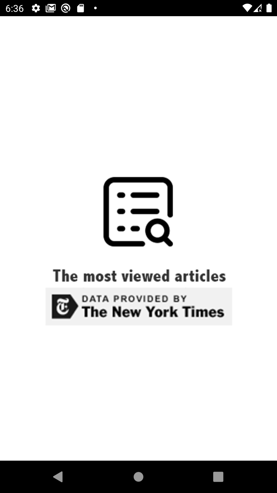
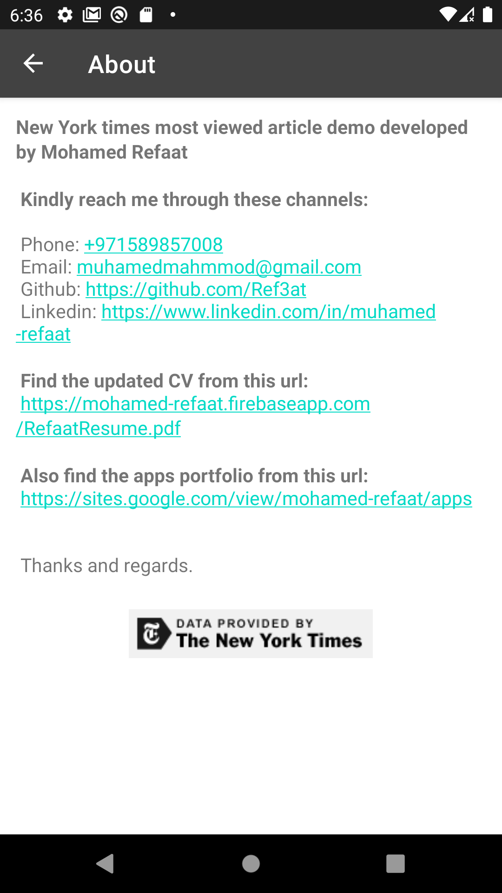

NYTimes Most Popular Articles demo by Refaat
===================================

This demo shows the most viewed articles for the New York Times filtered by last day, week and month.

Get The APK:
--------------

The app tech:
--------------

- Kotlin.
- Android SDK 32.
- MVVM architecture design pattern.
- ViewModel.
- LiveData.
- Kotlin Coroutines.
- Retrofit
- Glide
- Navigation component (safeargs).
- Material design. 
- ViewBinding.

Screenshots
-------------

 
 
 

 
 
 

The app data provided by The New York Times.
